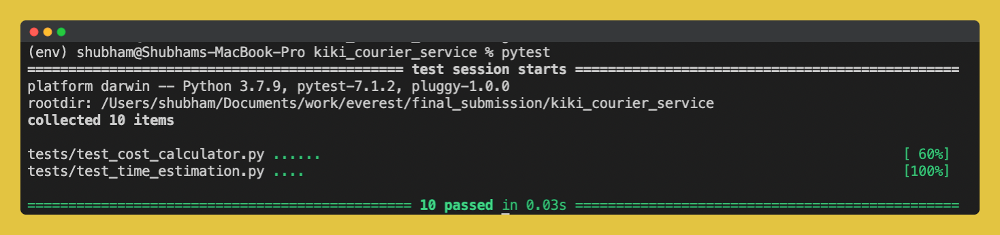
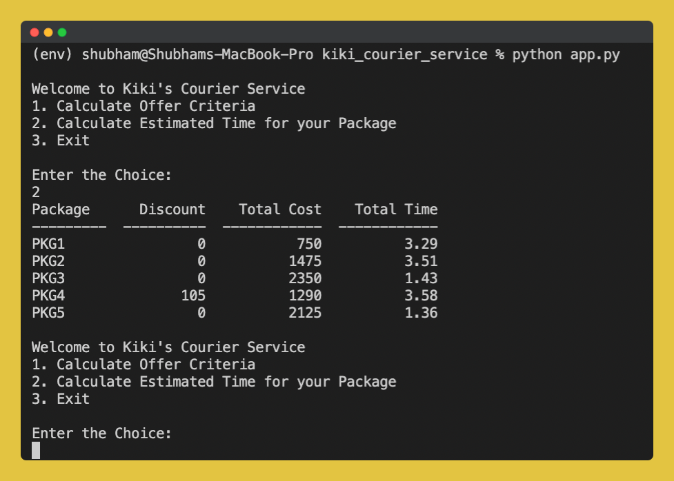
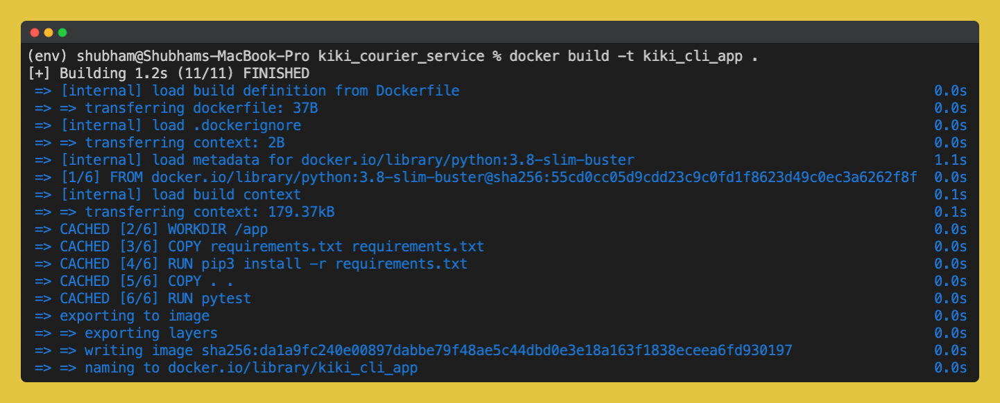
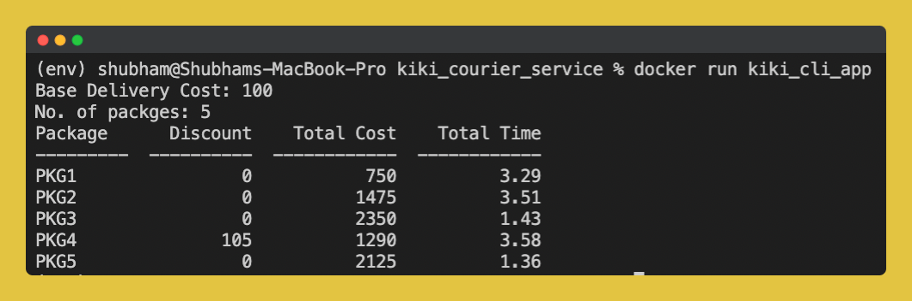

<!-- PROJECT LOGO -->
<br />
<p align="center">
  <a href="https://ibb.co/sC0TMQV">
    
  </a>

  <h3 align="center">Kiki's Courier Service</h3>

  <p align="center">
    Kiki, a first-time entrepreneur from the city of Koriko has decided to open a small distance courier service to deliver packages, with her friend Tombo and cat Joji. 


  <p align="center">
    <a href="https://github.com/LondheShubham153/kiki_courier_service">View Demo</a>
    ·
    <a href="https://github.com/LondheShubham153/">Report Bug</a>
    ·
    <a href="https://github.com/LondheShubham153/">Request Feature</a>
  </p>
</p>


<!-- TABLE OF CONTENTS -->
## Table of Contents

* [About the Project](#about-the-project)
  * [Built With](#built-with)
* [Getting Started](#getting-started)
  * [Prerequisites](#prerequisites)
  * [Installation](#installation)

* [Contributors](#contributors)
* [Contributing](#contributing)


<!-- ABOUT THE PROJECT -->
## About The Project

Kiki has invested in N no. of vehicles and have driver partners to drive each vehicle & deliver packages.!
We have 2 main problems to be solved:

- Delivery Cost Estimation with Offers
- Delivery Time Estimation

# Tested with Pytest



# The CLI app in action


# Built with Docker





# Installation

## Without Docker
```
pip install -r requirements.txt
pytest
python app.py

```

## With Docker
```
docker build -t kiki_cli_app .
docker run kiki_cli_app
```


## Built With
A list of commonly used resources that I find helpful are listed in the acknowledgements.
<p align="center"> 

 


</p>

## Contributors

<a href="https://github.com/LondheShubham153/kiki_courier_service/graphs/contributors">
  
</a>

<!-- CONTRIBUTING -->
## Contributing

Contributions are what make the open source community such an amazing place to be learn, inspire, and create. Any contributions you make are **greatly appreciated**.

1. Fork the Project
2. Create your Feature Branch (`git checkout -b feature/AmazingFeature`)
3. Commit your Changes (`git commit -m 'Add some AmazingFeature'`)
4. Push to the Branch (`git push origin feature/AmazingFeature`)
5. Open a Pull Request


